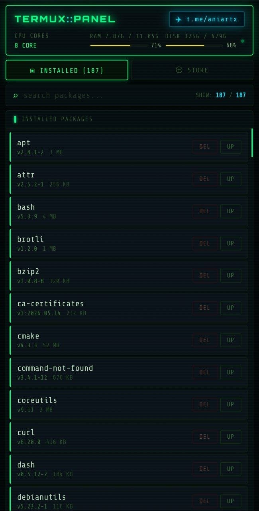
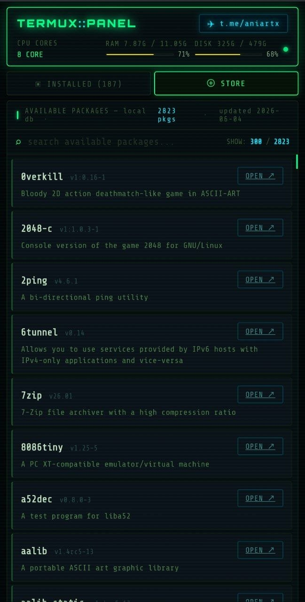

# 📱 Termux Panel — مدیریت ترموکس از مرورگر

یک پنل سبک و هکری برای مدیریت Termux از طریق مرورگر روی `localhost`، بدون نیاز به استفاده مستقیم از ترمینال.

---

## 🖼️ پیش‌نمایش

<p align="center">
  
  
</p>

---

## ⚙️ قابلیت‌ها

- 📦 نمایش لیست کامل پکیج‌های نصب‌شده
- ❌ حذف پکیج‌ها با یک کلیک
- 🔄 آپدیت پکیج‌ها با یک کلیک
- 📊 نمایش اطلاعات سیستم (CPU / RAM / Storage)
- ⏳ نوار پیشرفت هنگام اجرای عملیات‌ها
- 🧠 جستجوی سریع بین پکیج‌ها
- 📚 مرور استور پکیج‌های Termux (۱۰۰۰+ پکیج)
- 💾 دیتابیس لوکال پکیج‌ها (بدون نیاز به اینترنت)
- 🎨 رابط کاربری سبک با تم سایبرپانک و افکت‌های گرافیکی

---

## 🚀 اجرا

```bash
git clone https://github.com/ForExampleZERO/Termux-Panel.git
cd Termux-Panel
pip install flask
python update_pkgdb.py
python app.py
```

## 📢 Telegram Channel

💬 Join for updates, new releases and projects:

👉 [t.me/aniartx](https://t.me/aniartx)
